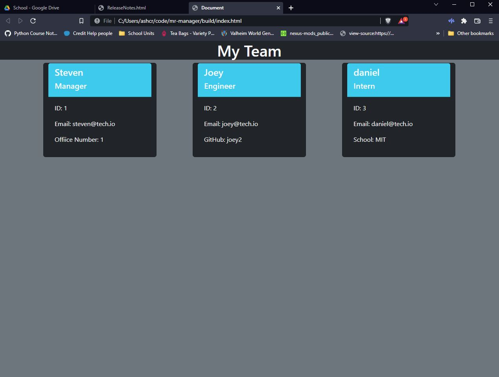

# Mr Manager

## Table Of Contents: 
  * [Description](#description)
  * [Installation](#installation)
  * [Usage](#usage)
  * [Contribution](#contribution)
  * [Testing](#testing)
  * [Contact](#contact)

## Description
This application allows the user to generate team members to a page.

)
## Installation 
Clone the repository locally and run 'npm i' to install all dependencies.

## Usage
run 'node index.js' to start the application.

## Walkthrough 
[Walkthrough](https://drive.google.com/file/d/15odbVjZvst_nGohCNmBZlyV8HZfpaAc2/view?usp=sharing)

## Contribution
A contributor would need basic knowledge of JavaScript and the Inquirer package.

## Testing
run `npm run test`

## Contact 
jashcraft
ashcraft.jonathon@gmail.com

